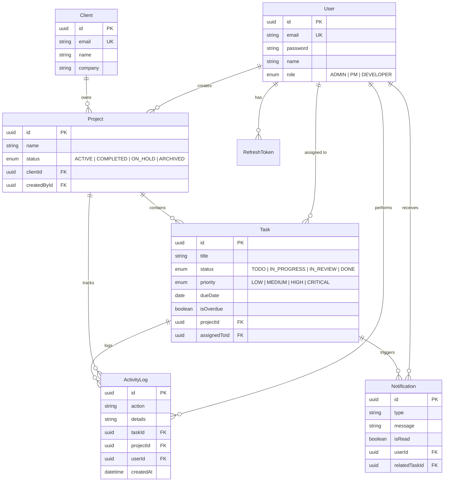

# Velozity — Real-Time Client Project Dashboard

A full-stack internal agency dashboard with **role-based access**, **real-time WebSocket activity feed**, **task management**, and **notifications**.

## Tech Stack

| Layer | Technology | Rationale |
|-------|-----------|-----------|
| Frontend | React + TypeScript + Vite | Type safety, fast HMR |
| Backend | Node.js + Express + TypeScript | Mature ecosystem, middleware support |
| Database | PostgreSQL + Prisma ORM | Type-safe queries, relational integrity, migrations |
| Real-time | Socket.io | Built-in rooms for role-filtered feeds, auto-reconnect, presence tracking |
| Background Jobs | node-cron | Lightweight, no Redis dependency, suitable for single-server overdue checking |
| Validation | Zod | Schema-based validation, type inference |

## Quick Start

### Prerequisites
- Node.js 18+
- PostgreSQL 14+ (or Docker)

### Setup (Docker preferred)

```bash
# Clone and install
git clone <repo-url>
cd Velozity

# 1. Start PostgreSQL via Docker Compose
docker-compose up -d

# 2. Setup Backend

```bash
# Clone and install
git clone <repo-url>
cd Velozity

# Backend
cd server
npm install
# Edit .env with your PostgreSQL connection string
npx prisma migrate dev --name init
npx prisma generate
npm run seed    # Seeds 1 Admin, 2 PMs, 4 Devs, 3 projects, 16+ tasks
npm run dev     # Starts on http://localhost:4000

# Frontend (new terminal)
cd client
npm install
npm run dev     # Starts on http://localhost:5173
```

### Login Credentials (Seeded)

| Role | Email | Password |
|------|-------|----------|
| Admin | admin@velozity.com | password123 |
| PM | prince@velozity.com | password123 |
| PM | priya@velozity.com | password123 |
| Developer | Deepak@velozity.com | password123 |
| Developer | sneha@velozity.com | password123 |
| Developer | kunal@velozity.com | password123 |
| Developer | neha@velozity.com | password123 |

## Database Schema



### Indexing Strategy

| Table | Indexed Columns | Rationale |
|-------|----------------|-----------|
| User | `email` (unique), `role` | Auth lookups, role-based queries |
| Project | `createdById`, `clientId`, `status` | PM ownership isolation, client filtering |
| Task | `projectId`, `assignedToId`, `status`, `priority`, `dueDate`, `isOverdue` | Kanban grouping, developer filtering, overdue queries |
| ActivityLog | `(projectId, createdAt DESC)`, `taskId`, `createdAt DESC` | Activity feed by project (most recent first), task history |
| Notification | `(userId, isRead)`, `createdAt DESC` | Unread count badge, notification listing |
| RefreshToken | `token` (unique), `userId` | Token lookup on refresh, user logout cleanup |

## Architectural Decisions

### WebSocket Library: Socket.io
Chosen over native WebSocket for: built-in **rooms** (critical for role-filtered feeds), **namespace** support, **auto-reconnect**, and **presence** tracking. The room mechanism maps directly to our access model:
- Admin → `global` room (all events)
- PM → `project:{id}` rooms (their projects only)
- Developer → `user:{id}` room + project rooms for assigned tasks

### Token Storage
- **Access token**: stored in `sessionStorage` (memory-like, cleared on tab close)
- **Refresh token**: stored in **HttpOnly cookie** — inaccessible to JavaScript, preventing XSS theft

### Background Jobs: node-cron
Chosen over Bull queue for simplicity — no Redis dependency needed. The overdue checker runs every 15 minutes, queries un-flagged past-due tasks, and emits WebSocket events for real-time updates.

### Role Enforcement
Roles are enforced at the **API middleware level** on every protected route. Frontend role guards exist only for UX — a Developer cannot reach PM data even by directly hitting API endpoints.

## Explanation

**Hardest Problem**: The most challenging aspect was architecting the real-time event distribution mechanism to securely enforce role-based access control directly within the WebSocket layer without compromising performance. Ensuring that developers only receive updates for their assigned tasks while PMs receive updates for their entire projects required meticulous synchronization between Prisma query logic and Socket.io room abstractions.

**Real-Time Role-Filtered Feed Handling**: I handled the activity feed by mapping Socket.io rooms directly to the application's domain access model during the initial WebSocket handshake. Users authenticate via JWT; upon valid verification, the server dynamically subscribes them to specific rooms: `global` for Admins, `project:{id}` rooms for PMs, and personal `user:{id}` rooms for Developers. When the `TaskController` processes a status update, it broadcasts the generated `ActivityLog` explicitly to the overarching `project:{id}` room, while ensuring developers catching notifications natively route to their isolated `user:{id}` channel. To handle network disruptions flawlessly, the client transmits a `lastSeenAt` timestamp upon reconnection, prompting the server to query historical logs from the PostgreSQL database to dispatch missed events, preventing memory cache bottlenecks.

**What I Would Do Differently**: If I were to iterate on this, I would implement a dedicated Redis adapter for Socket.io alongside an API Gateway. Currently, the real-time rooms are confined to a single Node.js instance's memory. Introducing Redis Pub/Sub would allow the WebSocket layer to scale horizontally across multiple clustered backend instances safely.

## Known Limitations

- No pagination on task lists (fine for <100 tasks per project)
- No drag-and-drop on Kanban board (status changes via dropdown)
- Single-server architecture (Socket.io would need Redis adapter for horizontal scaling)
- No email notifications (in-app only)
- Refresh token rotation doesn't invalidate all tokens on suspicious activity (no token family tracking)
